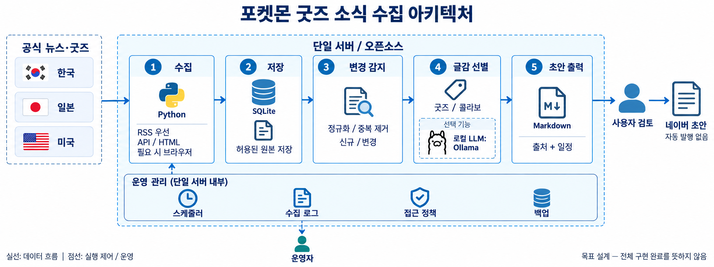
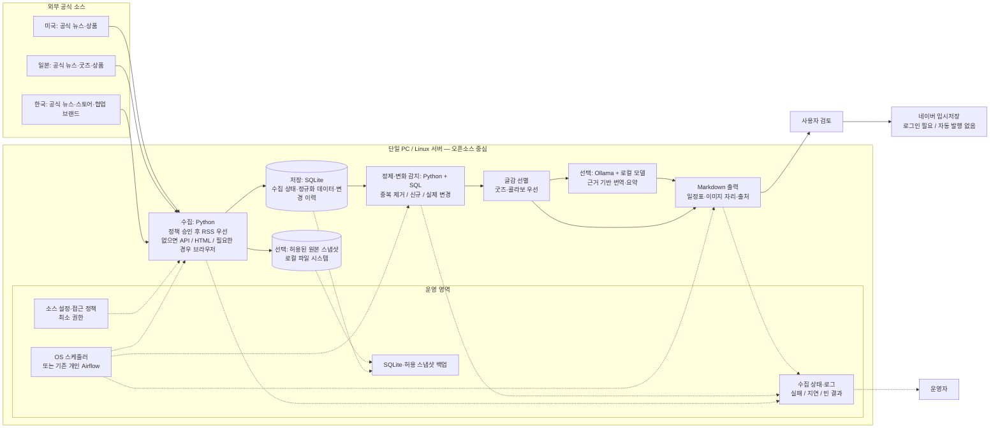
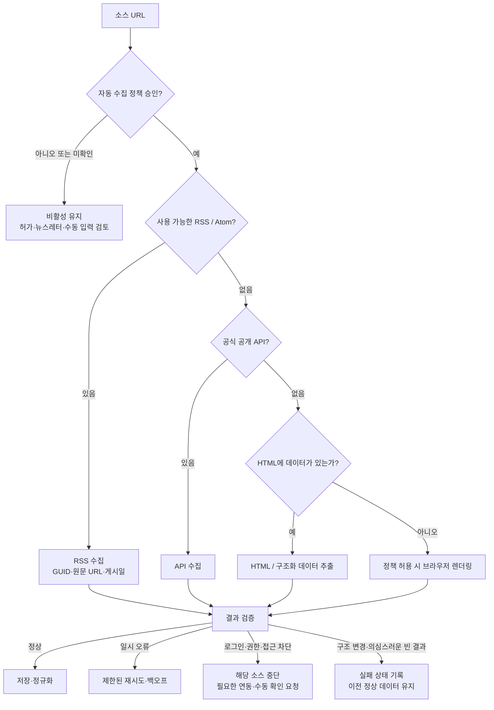

# Pokémon Goods Intelligence — Architecture

작성일: 2026-10-05 (Asia/Seoul)

한국·미국·일본의 공식 포켓몬 굿즈·콜라보 소식을 수집하고, 의미 있는 변경을 블로그 글감으로 정리하는 개인용 파이프라인의 목표 아키텍처다.

> **설계 문서이며 전체 구현 완료를 뜻하지 않는다.** 기존 프로젝트의 수집·SQLite·변경 감지·초안 기능을 재사용하고, RSS 우선 라우팅과 굿즈 소스를 점진적으로 확장한다. 이 작업에서는 기존 코드나 소스 활성화 설정을 변경하지 않았다.

## 1. 큰 아키텍처



이미지는 큰 구조를 설명하는 개념도다. 아래 Mermaid와 구현 상태표가 세부 동작과 구현 여부의 기준이다. 실선은 데이터 흐름, 점선은 실행 제어·운영 흐름이다.



## 2. RSS가 없을 때의 수집 경로



- RSS 장애는 RSS 부재와 다르다. 파싱 오류·타임아웃을 이유로 무조건 HTML로 전환하지 않는다.
- 사이트 내부 비인증 JSON endpoint는 공식 개발자 API와 구분한다. 정책·응답 스키마·유지보수 위험을 별도로 검토한다.
- 403/429, CAPTCHA, 로그인, 브라우저 보안 차단을 우회하지 않는다.
- RSS 제공이나 robots.txt 허용만으로 모든 콘텐츠·이미지의 저장·재배포 권한이 생기는 것은 아니다.

## 3. 단계별 컴포넌트

| 단계 | 최소 구성 | 선택 확장 | 도입 조건 |
|---|---|---|---|
| 실행 | Windows 작업 스케줄러 / Linux systemd timer | 기존 개인 Airflow | 복잡한 의존성·재처리·실행 이력 관리 필요 |
| 수집 | 기존 Python urllib·JSON·HTML 수집기 | feedparser, requests, Beautiful Soup, Playwright | RSS 소스나 기존 parser로 처리하기 어려운 소스가 실제로 확인됨 |
| 상태 저장 | 기존 SQLiteRepository | PostgreSQL | 다중 호스트·동시 쓰기·공유 서비스 |
| 원본 저장 | 기본은 출처·정규화 사실·해시 | 허용된 원본 파일 / 객체 저장소 | 정책 허용 및 재현·재처리 필요 |
| 변화 감지 | 기존 Python 서비스 + SQL | 상품/국가별 필드 추가 | 출시·예약·가격 등 굿즈 정보 확장 |
| 글감 생성 | 기존 digest·사실 템플릿 | Ollama + 로컬 모델 | 번역 품질·장비·모델 라이선스 검증 |
| 출력 | MD 파일 + 사용자 검토 | 검토 UI·네이버 입력 보조 | 반복적인 편집 업무가 확인됨 |
| 운영 | collection_runs·종료 코드·로그·백업 | Prometheus·Grafana | 지속 운영과 알림 필요 |

초기에는 Kafka, Spark, Kubernetes, API Gateway, Redis, 별도 데이터 웨어하우스를 도입하지 않는다. 단일 호스트 SQLite는 쓰기 동시성에 한계가 있으므로, 여러 서버가 동시에 쓰는 시점에 PostgreSQL로 전환한다.

## 4. 기존 구현과 목표 설계의 차이

2026-10-05 로컬 코드와 설정을 읽어 확인한 상태다. README의 과거 테스트 결과를 이번 작업의 새 검증 결과로 간주하지 않는다.

| 기능 | 현재 상태 | 목표 |
|---|---|---|
| 한국·일본 이벤트 수집 | Korea / Japan / UNITE collector가 CLI에 등록됨 | 정책 검토 후 굿즈 소스로 확대 |
| RSS 우선 | RSS collector와 우선 라우터는 확인되지 않음 | 유효 RSS가 있으면 우선 선택 |
| 데이터 정규화 | PokemonEvent dataclass와 검증 | 가격·통화·판매국·출시일·예약일 확장 |
| DB·변경 이력 | sources / collection_runs / events / event_history | 기존 구조 재사용 |
| 변경 감지 | NEW / UPDATED / UNCHANGED / ENDED | 굿즈 변경의 의미를 필드별 구분 |
| Markdown | digest / draft 및 daily.ps1 | 기존 문체·굿즈 표·출처 기반 초안 |
| 스케줄링 | 일일 스크립트 있음; OS 등록 상태는 미확인 | 사용자 환경에 맞춰 별도 등록 |
| 원본 스냅샷 | 일부 사실·해시·정규화 이력 저장 | 허용 소스에 한해 선택 보관 |
| 브라우저·로컬 LLM·메트릭 | 프로젝트 통합 확인되지 않음 | 필요할 때만 선택 도입 |
| 네이버 작성 | 이 프로젝트에 자동 입력 구현 확인되지 않음 | 로그인 후 사용자 검토·임시저장 |

재사용 대상: src/pokemon_events/collectors/, storage/repository.py, services/change_detector.py, services/blog_draft.py, cli.py, scripts/daily.ps1.

## 5. 한국·미국·일본 수집 후보 10개

인기·트래픽 순위가 아니라 블로그 글감 적합성 기준의 후보 우선순위다. 등록은 활성화를 뜻하지 않는다. RSS 주소와 현재 접근 정책은 소스별로 재검증해야 한다.

| 우선순위 | 지역 | 소스 | 용도 |
|---:|---|---|---|
| 1 | 한국 | [포켓몬코리아](https://www.pokemonkorea.co.kr/) | 국내 협업·행사·팝업 |
| 2 | 일본 | [공식 굿즈](https://www.pokemon.co.jp/goods/) | 굿즈·브랜드 협업 |
| 3 | 미국 | [Pokémon 뉴스](https://www.pokemon.com/us/pokemon-news) | 협업·시즌 컬렉션 |
| 4 | 한국 | [포켓몬 스토어](https://www.pokemonstore.co.kr/) | 국내 출시·가격·구매처 |
| 5 | 일본 | [포켓몬센터 특집](https://www.pokemoncenter-online.com/feature-list/) | 상품 구성·예약 |
| 6 | 미국 | [Pokémon Center 신상품](https://www.pokemoncenter.com/category/new-releases) | 미국 상품·가격 |
| 7 | 일본 | [포켓몬 공식 뉴스](https://www.pokemon.co.jp/info/) | 공지·일정·캠페인 |
| 8 | 한국 | [스파오 협업](https://www.spao.com/u/col-lineup) | 포켓몬 의류·런칭 |
| 9 | 일본 | [반다이 스케일 월드](https://www.bandai.co.jp/candy/pokemonscaleworld/) | 피규어·예약 |
| 10 | 미국 | [Pokémon Center 뉴스레터](https://support.pokemoncenter.com/hc/en-us/articles/4405458033812-How-do-I-sign-up-for-the-newsletter) | 신상품 보조 채널 |

**기존 정책 설정 유지:** config/sources.toml에서 pokemon_center_jp와 pokemon_go 등은 비활성 상태다. 이 문서와 이미지를 추가하며 활성화하지 않는다. 기존 README의 정책 조사 내용은 과거 조사 기록이므로 재검증 없이 최신 판정으로 단정하지 않는다.

## 6. 데이터·운영 계약

- 공통 식별: source_id + source_item_id. GUID 없는 RSS는 canonical URL 등을 소스별로 검토한다.
- 공지 게시일, 행사일, 예약일, 출시일, 배송 예정일을 서로 다른 필드로 다룬다.
- 가격은 원래 통화·판매 지역과 함께 저장한다. 국내 출시·직배송 여부는 추정하지 않는다.
- 동일 협업을 묶더라도 국가별 상품·가격·일정은 합쳐 덮어쓰지 않는다.
- 변경 판정에서 광고·수집 시각·내부 해시 변경 등 비즈니스 무변경을 제외한다.
- 목록에서 사라진 상품을 곧바로 판매 종료·삭제로 판정하지 않는다.
- LLM에는 근거를 전달하고, 외부 본문은 명령이 아닌 데이터로 취급한다. 생성 결과는 미확인 사실을 채우지 않고 검토 대상으로 남긴다.
- 저장·알림·초안 생성은 재실행 시 중복이 생기지 않도록 이벤트와 생성 상태를 기록한다.
- 운영 지표 후보: last_success_at, run_status, items_seen, schema_error_count, consecutive_failures.
- 원본 또는 DB가 필요한 경우 보존 기간과 용량 한도를 설정하고 별도 장치에 백업·복원 검증한다.
- 비밀정보는 문서·소스·Git·로그에 포함하지 않는다. 계정·메일·MCP·API 연결은 목적과 접근 범위를 설명한 뒤 승인받는다.
- 이미지 이용 조건 확인과 네이버 발행은 사용자 검토 단계로 분리한다.

## 7. 단계적 적용

1. 소스 3곳의 현재 정책·RSS·목록 구조를 재확인하고 RSS 우선 경로를 검증한다.
2. 허용된 소스만 수집하여 누락·중복·스키마 변경을 테스트한다.
3. 굿즈·콜라보의 출시·예약·국가별 정보를 기존 모델에 필요한 만큼 추가한다.
4. 글감 digest와 MD 템플릿을 재사용하고, 필요하면 번역·요약을 붙인다.
5. 계정 연동 후에도 네이버는 임시저장까지로 제한한다.

## 8. 공식 기술 참고

- [feedparser: RSS / Atom](https://feedparser.readthedocs.io/en/stable/introduction.html)
- [Requests](https://requests.readthedocs.io/en/latest/)
- [Beautiful Soup](https://www.crummy.com/software/BeautifulSoup/bs4/doc/)
- [Playwright Python](https://playwright.dev/python/docs/library)
- [SQLite 사용 기준](https://www.sqlite.org/whentouse.html)
- [Apache Airflow 개념](https://airflow.apache.org/docs/apache-airflow/stable/core-concepts/)
- [Ollama 로컬 API](https://github.com/ollama/ollama/blob/main/docs/api/introduction.mdx)

## 9. 이미지 제작 기록

- 방식: built-in image generation
- 파일: assets/architecture.png
- 이미지 역할: 목표 설계의 큰 구성도. 소스 권한과 구현 상태를 보장하지 않는다.
- 이미지 레이블은 한글로 구성하고 Python·SQLite·Ollama 등 기술 이름은 유지했다.
- 한글화 편집 프롬프트 (내장 imagegen, text-localization):

```text
Use case: text-localization. Input image is the edit target. Translate the architecture diagram's English explanatory labels into Korean. Preserve exactly the original wide layout, icons, blue colors, flags, five stages, all arrows, dashed host boundary and operations band. Use clean readable Korean sans serif typography; allow font size adjustments to prevent overlap. Keep technical proper names Python, SQLite, API / HTML, RSS, Markdown, Ollama, LLM.
Exact replacement text:
Title: "포켓몬 굿즈 소식 수집 아키텍처"
Left panel: "공식 뉴스·굿즈", "한국", "일본", "미국".
Host title: "단일 서버 / 오픈소스".
Stage 1 title "수집"; Python; "RSS 우선", "API / HTML", "필요 시 브라우저".
Stage 2 title "저장"; SQLite; "허용된 원본 저장".
Stage 3 title "변경 감지"; "정규화 / 중복 제거"; "신규 / 변경".
Stage 4 title "글감 선별"; "굿즈 / 콜라보"; optional box "선택 기능"; "로컬 LLM:"; "Ollama".
Stage 5 title "초안 출력"; Markdown; "출처 + 일정".
Right user "사용자 검토"; right document "네이버 초안"; small "자동 발행 없음".
Bottom band title "운영 관리 (단일 서버 내부)"; labels "스케줄러", "수집 로그", "접근 정책", "백업"; bottom person "운영자".
Bottom left legend "실선: 데이터 흐름 | 점선: 실행 제어 / 운영".
Bottom right note "목표 설계 — 전체 구현 완료를 뜻하지 않음".
No new boxes, components, logos or arrows. Accurate Hangul spelling and readable crisp text are essential. White opaque background.
```

- 최초 영문 이미지 생성 프롬프트 (기록용):

```text
Use case: infographic-diagram. Create a polished high-level open-source architecture diagram for a GitHub project called 'Pokemon Goods Intelligence'. Wide landscape white background, crisp flat infrastructure icons like professional cloud architecture documentation, large readable text, restrained blue/teal color palette. No AWS logo, no Pokemon characters, no watermark. Exact title 'Pokemon Goods Intelligence'. Layout left to right: outside a dashed boundary a stack 'Korea', 'Japan', 'USA', subtitle 'Official news and goods'. Central dashed boundary labeled 'Single Host / Open-source'. Inside exactly 5 clearly separated stages with arrow connections: 1 'Collect' with 'Python' and small lines 'RSS first', 'API / HTML', 'Browser if needed'; 2 'Store' with database cylinder labeled 'SQLite' and file icon labeled 'Permitted snapshots'; 3 'Detect Changes' with 'Normalize / Deduplicate' and 'NEW / UPDATED'; 4 'Curate' with 'Goods / Collaborations' and small OPTIONAL box 'Local LLM: Ollama'; 5 'Export' with 'Markdown' and 'Sources + Schedule'. Right outside boundary user icon labeled 'Human review' then document labeled 'Naver draft' and 'No auto-publish'. Solid arrows show Sources -> Collect -> Store -> Detect Changes -> Curate -> Export -> Human review -> Naver draft. Bottom within host boundary horizontal operations band with four icons 'Scheduler', 'Collection logs', 'Policy gate', 'Backups'. Dashed arrows from Scheduler toward Collect and from Collection logs toward an outside icon 'Operator'. Footer legend 'Solid: data flow | Dashed: control / operations'. Architecture must be unambiguous, diagrams schematic not photoreal. Footer small note 'Target architecture - not all components implemented'. Do not show Kafka, Spark, Kubernetes, API gateway or distributed data warehouse.
```
